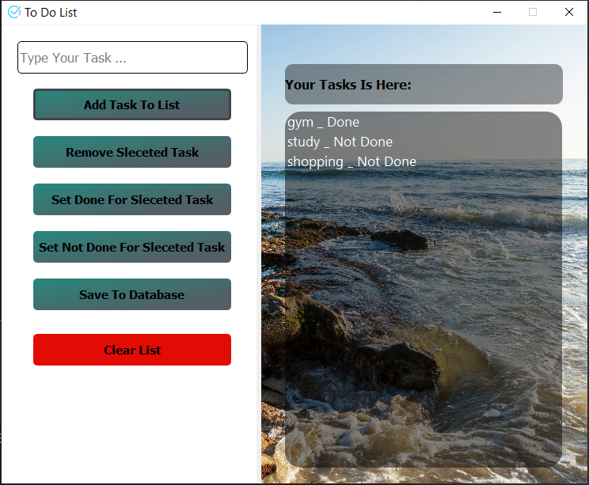

# ✅ To-Do List

A sleek and simple **To-Do List** application built using **Python** and **PyQt5**. It allows users to manage daily tasks with ease and stores data locally using a SQLite database.

---

## 📂 Project Structure

```
To-Do-List/
├── To_Do_List.py                # Main Python application
├── To Do List.ui                # UI file created with Qt Designer
├── alarm 2.png                  # Alarm icon for UI
├── check (1).png                # Checkbox icon for UI
├── list.db                      # SQLite database file for tasks
├── trac-vu-aMnMaT7DJGs (2).jpg  # Background image
├── res.qrc                      # Qt resource configuration
├── res.py                       # Compiled resource file
├── LICENSE                      # Project license (MIT)
├── README.md                    # Project documentation
└── screenshots/
    └── screenshot.PNG           # Screenshot of the application
```

---

## 🖼 Screenshot



---

## 🚀 Getting Started

### Clone the repository

```bash
git clone https://github.com/Ghesmatireza8/To-Do-List.git
cd To-Do-List
```

### Install dependencies

```bash
pip install PyQt5
```

### Run the app

```bash
python To_Do_List.py
```

---

## ✨ Features

- 📝 Add, edit, and delete tasks
- ✅ Visual checkbox icons and styled UI
- 💾 Task persistence using SQLite
- 🎨 Clean and modern interface

---

## 👤 Author

**Reza Ghesmati**  
📎 [GitHub](https://github.com/Ghesmatireza8)

---

## 📄 License

This project is licensed under the terms of the **MIT License**.  
See the [LICENSE](LICENSE) file for details.
